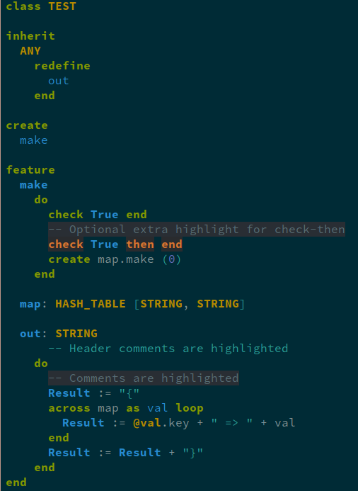
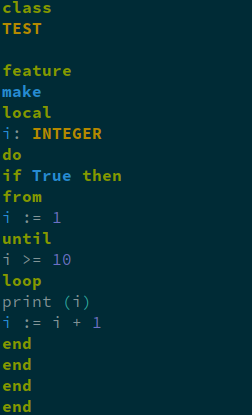
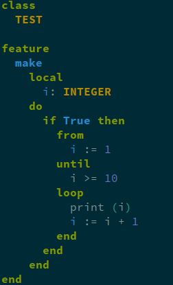

# eiffel-ts-mode
This is an emacs major mode for the Eiffel programming language.

<table>
<tr>
<td>
	
</td>
<td>
	
	
</td>
</tr>
<tr>
<td>
Code highlight
</td>
<td>
Automatic indentation
</td>
</tr>
</table>

## Installation
### Emacs
This package requires Emacs 29 built with tree-sitter support.

To check if your Emacs has tree-sitter support check
```lisp
(treesit-available-p)
```

### Install the Eiffel grammar
This package does not automatically install the grammar yet.

A compatible tree-sitter Eiffel grammar is available at
<https://github.com/imustafin/tree-sitter-eiffel>. The compatible version is
`v1.0.0`.

Emacs will look for the compiled grammar in the following paths:
> * first, in the list of directories specified by the variable `treesit-extra-load-path`;
> * then, in the `tree-sitter` subdirectory of the directory specified by `user-emacs-directory` (see The Init File);
> * and finally, in the system’s default locations for dynamic libraries.
<https://www.gnu.org/software/emacs/manual/html_node/elisp/Language-Grammar.html>

The `user-emacs-directory` is `~/.emacs.d` by default, so putting
`libtree-sitter-eiffel.so` in `~/.emacs.d/tree-sitter/` is enough.

### Install `eiffel-ts-mode`
This package is not available in any package archives yet.

#### Using `package-vc-install`
You can run the following to install the package:
```lisp
(package-vc-install "https://github.com/imustafin/eiffel-ts-mode")
```

#### Install manually
You can clone the repository, add its path to `load-path` and
evaluate `eiffel-ts-mode.el`.

Assuming you are in the home directory:
```bash
git clone https://github.com/imustafin/eiffel-ts-mode.git
```
Execute
```lisp
(add-to-list 'load-path "~/eiffel-ts-mode/")
```
And execute `eiffel-ts-mode.el`.

### (optional) Install the Spacemacs configuration layer
This repository includes the `eiffel` layer definition in the `eiffel` folder.

To use it:
1. Add the path of this repository to `dotspacemacs-configuration-layer-path`
  (Not the `eiffel/` directory)
2. Add `eiffel` to `dotspacemacs-additional-packages`

Also check the `eiffel/README.org`
